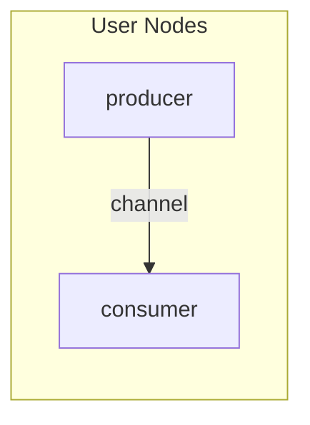
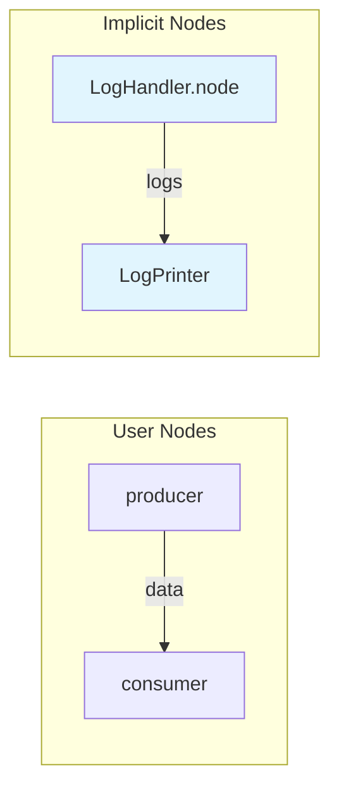
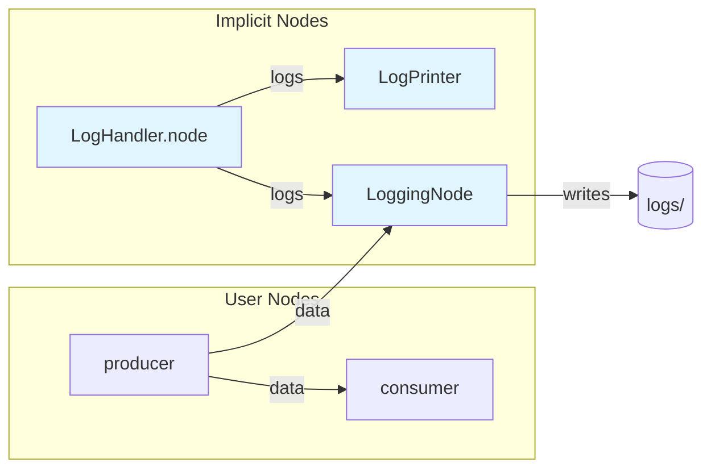
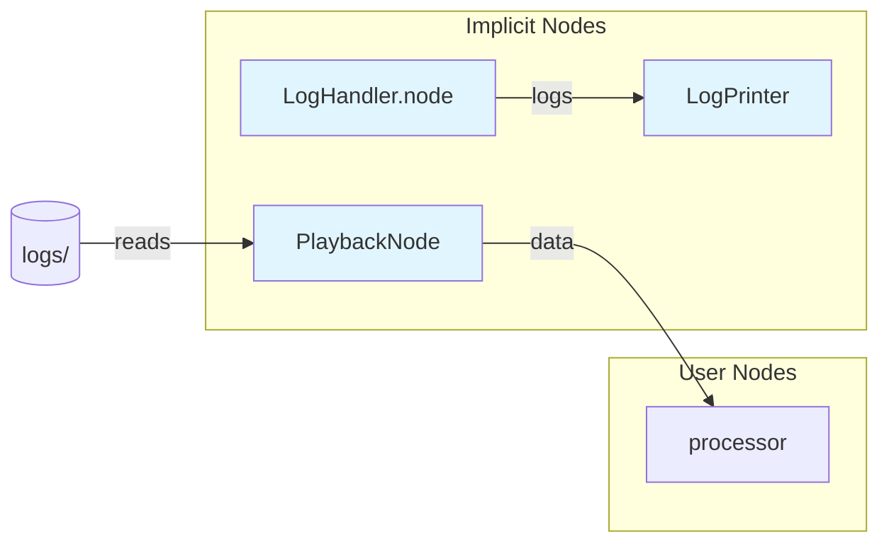
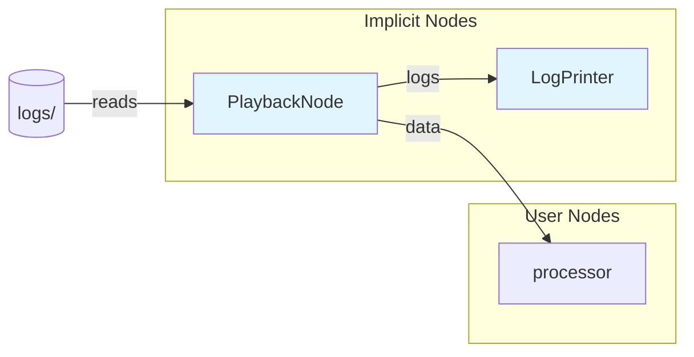
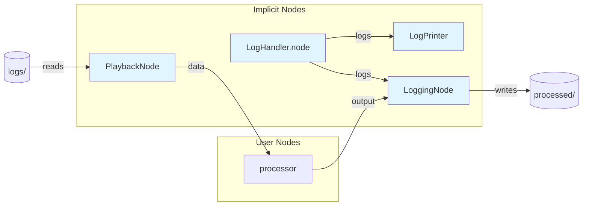
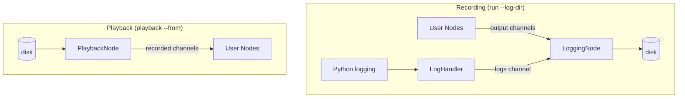

# Tinman CLI Modes

This document shows the implicit nodes that Tinman creates in different CLI modes.

## `tinman run`

### Basic Run (no logging)

```bash
tinman run myapp:producer,consumer --no-capture-logs
```



### Run with Log Capture (default)

```bash
tinman run myapp:producer,consumer
```



*Python logging from any node is captured and printed to console.*

### Run with Logging to Disk

```bash
tinman run myapp:producer,consumer --log-dir logs/
```



*All output channels (including logs) are written to disk.*

---

## `tinman playback`

### Playback with Log Capture (default)

```bash
tinman playback --from logs/ myapp:processor
```



*Recorded data is played back. New Python logs from `processor` are captured and printed.*

### Playback without Log Capture (view recorded logs)

```bash
tinman playback --from logs/ myapp:processor --no-capture-logs
```



*Recorded data AND recorded logs are played back. The LogPrinter shows the original logs from when the data was recorded.*

### Playback with Re-logging

```bash
tinman playback --from logs/ myapp:processor --log-dir processed/
```



*Recorded data is played back through processor. New outputs and new logs are written to a new directory.*

---

## Node Legend

| Node | Purpose |
|------|---------|
| **PlaybackNode** | Reads recorded channels from `.blog` files and publishes them with original timing |
| **LogHandler.node** | Captures Python `logging` calls and publishes them as `LogEntry` messages |
| **LogPrinter** | Subscribes to logs channel and prints entries to console |
| **LoggingNode** | Subscribes to all output channels and writes them to `.blog` files |

All implicit nodes are **daemons** - they are cancelled when user nodes complete.

---

## Channel Flow Summary


